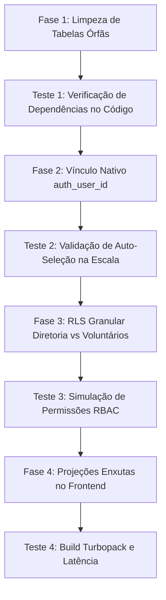

# Plano de Execução: Otimização de Arquitetura, Limpeza de Schemas e Segurança RLS

> **Documento de Planejamento (`/plan`)**  
> **Slug do Plano**: `PLAN-database-optimization`  
> **Status**: Pronto para Aprovação  
> **Responsáveis**: `@[backend-specialist]`, `@[database-design]`, `@[frontend-specialist]`

---

## 🎯 Objetivo Geral
Executar a consolidação arquitetural do banco de dados Supabase e sua integração com o frontend do Sistema ELO (Instituto Ádapo), garantindo:
1. Eliminação de tabelas órfãs/mortas.
2. Vinculação nativa de identidade entre usuários autenticados (`auth.users`) e voluntários (`public.voluntarios`).
3. Blindagem de segurança com RLS granular (separação real de permissões entre Diretoria/Coordenação e Voluntários Operacionais).
4. Otimização de payload em consultas no frontend (projeções enxutas em substituição a `SELECT *`).
5. **Etapas de testes obrigatórias a cada fase** para comprovar conformidade funcional sem regressão.

---

## 📋 Estrutura das Fases e Tarefas

---

### 🔹 Fase 1: Limpeza Segura de Schemas e Tabelas Órfãs

#### Atividades:
- [ ] Verificar todas as referências no código a `public.pecas_comunicacao_projeto` (tabela antiga legada com 0 linhas).
- [ ] Aplicar migração via MCP para descartar a tabela de forma segura (`DROP TABLE IF EXISTS public.pecas_comunicacao_projeto CASCADE;`).
- [ ] Atualizar documentação do schema em `supabase/schema.sql`.

#### 🧪 Etapa de Testes (Teste 1):
- [ ] Rodar grep search em todo o diretório `src/` para assegurar que nenhuma tela consulta ou grava nessa tabela.
- [ ] Executar consulta via Supabase Client para confirmar que o módulo de comunicação continua 100% operacional consumindo `conteudos_comunicacao`.

---

### 🔹 Fase 2: Vínculo Nativo de Identidade (`voluntarios.auth_user_id`)

#### Atividades:
- [ ] Criar migração no Supabase adicionando a coluna `auth_user_id UUID REFERENCES auth.users(id) ON DELETE SET NULL` na tabela `public.voluntarios`.
- [ ] Criar índice de performance `CREATE INDEX idx_voluntarios_auth_user_id ON public.voluntarios(auth_user_id);`.
- [ ] Executar script de reconciliação de dados que mapeia os usuários de `auth.users` / `profiles` existentes aos voluntários correspondentes através do e-mail.
- [ ] Atualizar o trigger `public.handle_new_user()` para associar automaticamente o `auth_user_id` na criação de novos usuários quando o e-mail já existir em `voluntarios`.
- [ ] Atualizar o frontend ([VoluntariosEscalaDisponibilidade.tsx](file:///c:/Users/Aroso%20&%20Pontin%20Adv/Downloads/Elo---Gest-o-dapo-main/Elo---Gest-o-dapo-main/src/components/dashboard/voluntarios/VoluntariosEscalaDisponibilidade.tsx) e [Topbar.tsx](file:///c:/Users/Aroso%20&%20Pontin%20Adv/Downloads/Elo---Gest-o-dapo-main/Elo---Gest-o-dapo-main/src/components/layout/Topbar.tsx)) para priorizar `v.auth_user_id === user.id`, mantendo fallback por e-mail/nome.

#### 🧪 Etapa de Testes (Teste 2):
- [ ] Testar script de verificação no banco validando que os voluntários cadastrados possuem seus `auth_user_id` preenchidos.
- [ ] Acessar `/dashboard/voluntarios/escalas` no navegador e validar que o voluntário logado é selecionado de forma determinística e com 0ms de atraso.

---

### 🔹 Fase 3: RLS Granular e Controle de Acesso (RBAC)

#### Atividades:
- [ ] Definir papéis autorizados para homologação executiva: `role IN ('admin', 'coordenador')`.
- [ ] Criar migração atualizando as políticas de RLS em `recessos_voluntarios`:
  - **SELECT**: Qualquer autenticado pode visualizar folgas.
  - **INSERT**: Qualquer voluntário pode solicitar folga individual para si mesmo (`voluntario_id IN (SELECT id FROM voluntarios WHERE auth_user_id = auth.uid())`).
  - **UPDATE / DELETE**: Apenas diretoria/coordenação (`profiles.role IN ('admin', 'coordenador')`).
- [ ] Criar migração atualizando políticas em `voluntarios`:
  - **SELECT**: Qualquer autenticado pode consultar o catálogo da equipe.
  - **INSERT / UPDATE / DELETE (status, dados cadastrais)**: Restrito a `admin` e `coordenador`.

#### 🧪 Etapa de Testes (Teste 3):
- [ ] Teste de invasão/permissão (Red Team Check): Tentar atualizar o status de um voluntário simulando token de `voluntario_operacional` (deve ser rejeitado pelo banco).
- [ ] Teste com usuário `admin`: Atualizar status de voluntário e aprovar folga na tela de Gestão de Pessoas (deve persistir com sucesso HTTP 200).

---

### 🔹 Fase 4: Otimização de Consultas no Frontend (Projeções Seletivas)

#### Atividades:
- [ ] Em [src/lib/services/voluntariosService.ts](file:///c:/Users/Aroso%20&%20Pontin%20Adv/Downloads/Elo---Gest-o-dapo-main/Elo---Gest-o-dapo-main/src/lib/services/voluntariosService.ts):
  - Refinar a consulta de listagem para selecionar apenas as colunas consumidas na tabela e cartões (omitir textos longos de anamnese e observações pesadas até que o card de detalhes seja aberto).
- [ ] Em [src/app/dashboard/beneficiarios/page.tsx](file:///c:/Users/Aroso%20&%20Pontin%20Adv/Downloads/Elo---Gest-o-dapo-main/Elo---Gest-o-dapo-main/src/app/dashboard/beneficiarios/page.tsx):
  - Aplicar projeção seletiva para a listagem de crianças/famílias, reduzindo a transferência de 34 colunas para as essenciais da tabela.
- [ ] Em [src/app/dashboard/projetos/page.tsx](file:///c:/Users/Aroso%20&%20Pontin%20Adv/Downloads/Elo---Gest-o-dapo-main/Elo---Gest-o-dapo-main/src/app/dashboard/projetos/page.tsx):
  - Evitar trazer os grandes blocos de texto (diagnóstico de 10 páginas, despesas, objetivos) no grid inicial, carregando-os apenas no dossiê de projeto (`[id]/page.tsx`).

#### 🧪 Etapa de Testes (Teste 4):
- [ ] Medir o tamanho do payload transferido via Network DevTools (redução esperada de 60% a 80% em KB).
- [ ] Confirmar que nenhuma informação visual ou filtro de busca quebrou nas 3 listagens.

---

### 🔹 Fase 5: Validação Geral de Regressão e Deploy

#### Atividades & Testes:
- [ ] Executar script de auditoria `python .agent/scripts/checklist.py .` para validação de segurança e lint.
- [ ] Rodar compilação de produção com Turbopack: `next build` (todas as 36 rotas com 0 erros).
- [ ] Realizar commit semântico e envio para a branch `main`.

---

## 🛡️ Critérios de Aceitação (Definition of Done)
1. Nenhuma dependência órfã permanece no banco ou no código.
2. Cada voluntário cadastrado possui vínculo direto com o usuário Supabase Auth.
3. As regras de permissão de diretoria são garantidas pelo banco de dados (RLS) e não apenas no frontend.
4. As telas de listagem continuam abrindo instantaneamente (0ms) com payload de rede significativamente menor.
5. Build de produção conclui com **0 erros**.
