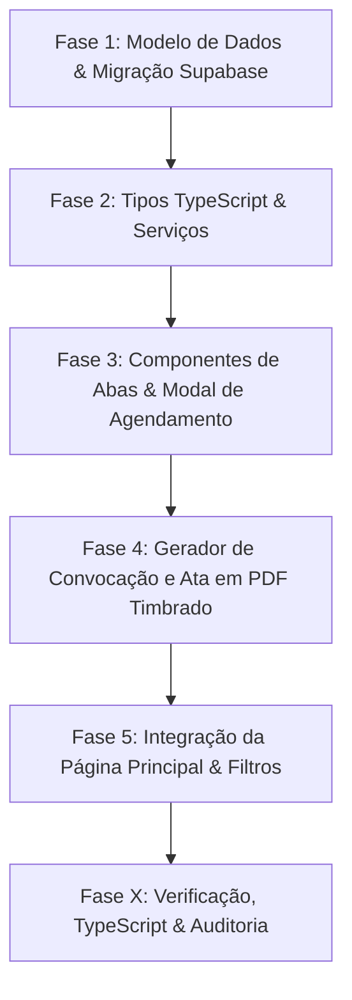

# Plano de Execução: Módulo de Reuniões, Pautas e Atas Institucionais

> **Documento de Planejamento (`/plan`)**  
> **Slug do Plano**: `PLAN-gestao-reunioes-atas`  
> **Status**: Pronto para Aprovação  
> **Tipo de Projeto**: WEB (`frontend-specialist`, `backend-specialist`, `database-architect`)  
> **Baseado em**: Opção A recomendada no Brainstorm (Evolução Modular Integrada com Ciclo de Vida em 3 Abas e Geração Automática de Atas Timbradas)

---

## 🎯 Visão Geral do Projeto

Transformar a tela de **Gestão Institucional** (`/dashboard/institucional`) em um módulo de alta produtividade para **Governança, Reuniões e Atas** do Instituto Ádapo. O módulo permitirá agendar reuniões (vinculadas a projetos sociais específicos ou institucionais gerais), estruturar tópicos de pauta com horários, controlar lista de presença (presentes vs ausentes), conduzir o encontro, redigir atas com assistente automático de redação formal e emitir tanto a **Convocação Oficial** quanto a **Ata Concluída** em **PDF com Papel Timbrado do Instituto Ádapo** e campos de assinatura.

---

## 🏆 Critérios de Sucesso (Mensuráveis)

1. **Vínculo com Projetos**: Reuniões podem ser associadas a qualquer projeto de `projetos_sociais` ou definidas como "Institucional Geral / Diretoria", com filtros reativos na interface.
2. **Horários e Pautas Estruturadas**: Cadastro com horário de início, previsão de término/duração, modalidade (presencial/online/híbrido) e lista dinâmica de tópicos de pauta.
3. **Controle de Presença & Encaminhamentos**: Possibilidade de marcar presentes e ausentes, registrar deliberações e mapear encaminhamentos (tarefas geradas com responsável e prazo).
4. **Exportação Dupla em PDF Timbrado**:
   - **PDF de Convocação / Pauta**: Para envio prévio aos membros com cronograma e tópicos.
   - **PDF de Ata Oficial**: Formatado conforme padrão de atas de organizações da sociedade civil, com cabeçalho do Instituto Ádapo, participantes, deliberações, decisões e linhas de assinatura (Presidente e Secretário).
5. **UI & UX Premium**: Layout Master-Detail arejado (`max-w-7xl mx-auto`), sem colisão com a Sidebar, Micro-KPIs compactos no topo e abas ergonômicas de ciclo de vida.
6. **Zero Erros TypeScript**: Compilação 100% limpa com `npx tsc --noEmit`.

---

## 🛠️ Stack Tecnológica & Arquitetura

- **Framework**: Next.js 14 (App Router) + React 18 + TypeScript.
- **Estilização**: Tailwind CSS com Design Tokens do ELO (Laranja `#F2632D`, Dark/Light Mode com variáveis CSS `--bg-secondary`, `--text-primary`, `--border-default`).
- **Banco de Dados**: Supabase (PostgreSQL) com tabela `reunioes_institucional` evoluída e relacionamento com `projetos_sociais(id)`.
- **Impressão/PDF**: Componente nativo [PapelTimbradoModal.tsx](file:///c:/Users/Usuario/Desktop/ERP-Providenciando-ong-main/Elo%20-%20sistema%20de%20gest%C3%A3o%20Insituto%20%C3%81dapo/src/components/ui/PapelTimbradoModal.tsx) configurado para `@media print` com margens A4 e cabeçalho institucional.

---

## 🗂️ Estrutura de Arquivos

```
Elo - sistema de gestão Insituto Ádapo/
├── supabase/
│   └── migrations/
│       └── 20260906_create_or_update_reunioes_institucional.sql  # [NEW] Migração Supabase
├── src/
│   ├── types/
│   │   └── reuniao.ts                                            # [NEW] Tipagens completas
│   ├── components/
│   │   └── dashboard/
│   │       └── institucional/
│   │           ├── ReuniaoPautaTab.tsx                           # [NEW] Aba de Pauta e Convocação
│   │           ├── ReuniaoPresencaTab.tsx                        # [NEW] Aba de Presença e Condução
│   │           ├── ReuniaoAtaTab.tsx                             # [NEW] Aba de Ata e Encaminhamentos
│   │           ├── ModalNovaReuniao.tsx                          # [NEW] Modal com seleção de projeto
│   │           └── ReuniaoPrintTemplate.tsx                      # [NEW] Template timbrado para Convocação e Ata
│   └── app/
│       └── dashboard/
│           └── institucional/
│               └── page.tsx                                      # [MODIFY] Página principal com Master-Detail
```

---

## 📋 Detalhamento das Fases e Tarefas



---

### 🔹 Fase 1: Modelo de Dados & Migração Supabase
**Agente Responsável**: `@[database-architect]`  
**Skills**: `database-design`, `clean-code`

#### Atividades:
- Criar a migração `supabase/migrations/20260906_create_or_update_reunioes_institucional.sql` garantindo compatibilidade retroativa com os registros existentes:
  - `projeto_id UUID REFERENCES projetos_sociais(id) ON DELETE SET NULL`
  - `horario_fim TIMESTAMP WITH TIME ZONE`
  - `duracao_estimada_min INTEGER DEFAULT 60`
  - `modalidade VARCHAR(20) DEFAULT 'presencial'` (`presencial` | `online` | `hibrida`)
  - `link_virtual TEXT`
  - `pautas_topicos JSONB DEFAULT '[]'` (array de `{ id, titulo, tempo_min, responsavel, deliberacao }`)
  - `encaminhamentos JSONB DEFAULT '[]'` (array de `{ id, descricao, responsavel, prazo, status }`)
  - `presentes TEXT[] DEFAULT '{}'`
  - `ausentes TEXT[] DEFAULT '{}'`
  - `secretario TEXT`
  - `presidente TEXT`
  - Atualização dos tipos e permissões RLS para permitir leitura e escrita autenticada.

- **INPUT**: Schema atual de `reunioes_institucional` e tabela `projetos_sociais`.
- **OUTPUT**: Arquivo de migração SQL testável e idempotente.
- **VERIFY**: Execução de query no Supabase ou verificação de sintaxe SQL sem erros de integridade referencial.

---

### 🔹 Fase 2: Tipagem TypeScript & Contratos de Dados
**Agente Responsável**: `@[backend-specialist]`  
**Skills**: `clean-code`

#### Atividades:
- Criar `src/types/reuniao.ts`:
  - Interface `Reuniao` com campos enriquecidos (projeto vinculado com nome e cor, tópicos de pauta estruturados, encaminhamentos tipados, presentes/ausentes, metadados).
  - Interfaces auxiliares: `TopicoPauta`, `EncaminhamentoReuniao`, `TipoReuniao`, `StatusReuniao`.
  - Helpers de formatação de data/hora institucional (ex: *"Segunda-feira, 15 de Setembro de 2026, das 19:00 às 20:30"*).

- **INPUT**: Especificação de campos da Fase 1.
- **OUTPUT**: Arquivo `src/types/reuniao.ts`.
- **VERIFY**: Importação nos componentes sem erros de tipo.

---

### 🔹 Fase 3: Componentes Especializados do Ciclo de Vida
**Agente Responsável**: `@[frontend-specialist]`  
**Skills**: `frontend-design`, `ui-ux-pro-max`

#### Atividades:
1. **`ModalNovaReuniao.tsx`**:
   - Seleção de Projeto Social (carrega projetos ativos de `projetos_sociais` ou opção "Institucional Geral").
   - Campos de data e horário de início e fim com cálculo automático de duração.
   - Modalidade com campo condicional de Link Virtual (Meet/Teams/Zoom) ou Local Físico.
   - Lista dinâmica de tópicos de pauta com botão `+ Adicionar Tópico`.
2. **`ReuniaoPautaTab.tsx` (Aba 1: Pauta & Convocação)**:
   - Visualização organizada dos tópicos previstos e tempos estimados.
   - Botão para exportar/imprimir Convocação Oficial em PDF timbrado.
   - Acesso rápido para ingressar no link virtual da reunião se houver.
3. **`ReuniaoPresencaTab.tsx` (Aba 2: Condução & Presença)**:
   - Painel interativo de chamada: listar participantes cadastrados e adicionar novos participantes avulsos.
   - Alternância com 1 clique entre Presente e Ausente.
   - Campo para anotações rápidas durante o encontro.
4. **`ReuniaoAtaTab.tsx` (Aba 3: Ata & Encaminhamentos)**:
   - Botão *"Gerar Minuta Automática da Ata"*: compila data, presença e tópicos de pauta no padrão textual formal de ONGs.
   - Editor de ata completo com suporte a formatação limpa.
   - Gestor de Encaminhamentos / Tarefas da reunião (Tabela com: O que fazer, Quem é o responsável, Qual é o prazo, Status).

- **INPUT**: Design System do Elo e tipos da Fase 2.
- **OUTPUT**: Componentes modulares, desacoplados e responsivos.
- **VERIFY**: Teste de renderização isolada de cada aba com dados mockados e reais.

---

### 🔹 Fase 4: Gerador de PDF Timbrado Oficial (Convocação & Ata)
**Agente Responsável**: `@[frontend-specialist]`  
**Skills**: `frontend-design`, `clean-code`

#### Atividades:
- Criar `ReuniaoPrintTemplate.tsx` integrado com `PapelTimbradoModal`:
  - **Modo "Convocação / Pauta"**: Cabeçalho do Instituto Ádapo, dados de horário e local, objetivo da reunião, rol de pautas com tempos e assinatura da convocação.
  - **Modo "Ata Oficial"**: Cabeçalho oficial, texto formal da ata, lista de presentes por extenso, deliberações e resoluções numeradas, tabela de encaminhamentos com prazos, e blocos formais para assinatura do Presidente e Secretário.
  - Estilização específica com `@media print` para garantir quebras de página perfeitas sem cortar texto e sem elementos de tela (botões, sidebar, etc.).

- **INPUT**: Dados da reunião selecionada e componente `PapelTimbradoModal`.
- **OUTPUT**: Template de impressão com 2 modos de exportação em PDF.
- **VERIFY**: Abertura do modal, visualização prévia e acionamento da impressão/PDF no navegador.

---

### 🔹 Fase 5: Integração da Página Principal & Filtros Reativos
**Agente Responsável**: `@[frontend-specialist]`  
**Skills**: `frontend-design`, `ui-ux-pro-max`

#### Atividades:
- Atualizar `src/app/dashboard/institucional/page.tsx`:
  - Envolver todo o conteúdo no container arejado `w-full max-w-7xl mx-auto space-y-6 flex-1 overflow-y-auto` com padding simétrico.
  - Substituir os cards antigos por **Micro-KPIs compactos**:
    1. *Total de Reuniões*
    2. *Agendadas / Próximas*
    3. *Atas Concluídas & Lavradas*
    4. *Reuniões de Projetos*
  - Barra de ferramentas em linha única com:
    - Campo de busca por título, pauta ou ata.
    - Filtro por Projeto (`Todos`, `Geral / Diretoria`, ou projeto social específico).
    - Filtro por Status (`Todos`, `Agendada`, `Em Andamento`, `Concluída`, `Cancelada`).
    - Filtro por Tipo de Reunião.
  - Painel Master-Detail com lista lateral com badges de projeto e status, e painel lateral com as 3 abas de ciclo de vida.
  - Topbar com título "Reuniões & Governança" e subtítulo atualizado.

- **INPUT**: Componentes criados nas fases anteriores e consulta de dados no Supabase.
- **OUTPUT**: Página principal integrada, fluida e reativa.
- **VERIFY**: Navegação entre reuniões, troca de filtros, abertura do modal de agendamento e alternância de abas.

---

## 🧪 Fase X: Verificação e Checklist Final

- [ ] Executar `npx tsc --noEmit` para garantir **0 erros de compilação**.
- [ ] Validar que reuniões vinculadas a um projeto exibem a tag e cor correspondente do projeto.
- [ ] Validar que reuniões sem projeto específico aparecem identificadas como "Institucional Geral".
- [ ] Validar a adição de tópicos de pauta e o cálculo de horários de início e término.
- [ ] Validar o gerador automático de minuta de ata.
- [ ] Validar a exportação de PDF da Convocação e da Ata Oficial no Papel Timbrado do Instituto Ádapo.
- [ ] Validar a exclusão e edição de reuniões.
- [ ] Validar conformidade com as regras de contraste e acessibilidade (WCAG AA) e ausência de roxo em botões de ação primária (uso do Laranja `#F2632D`).

---

## 🚀 Próximos Passos
Após a aprovação deste plano de execução, iniciaremos a implementação seguindo estritamente as fases descritas.
